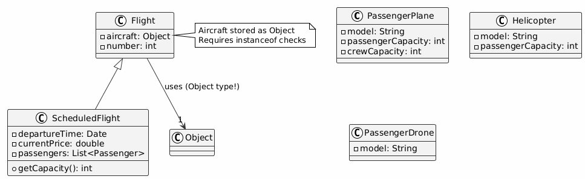
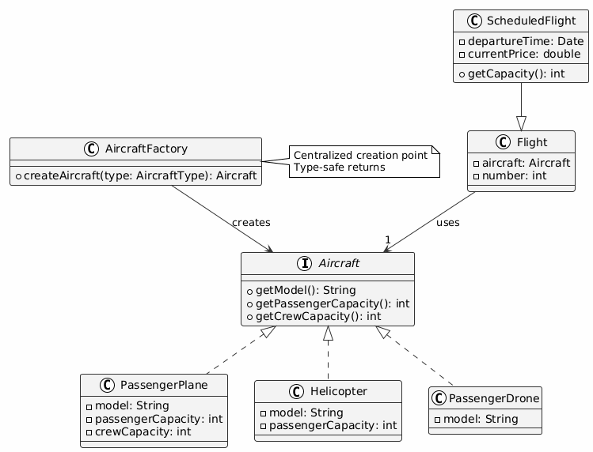
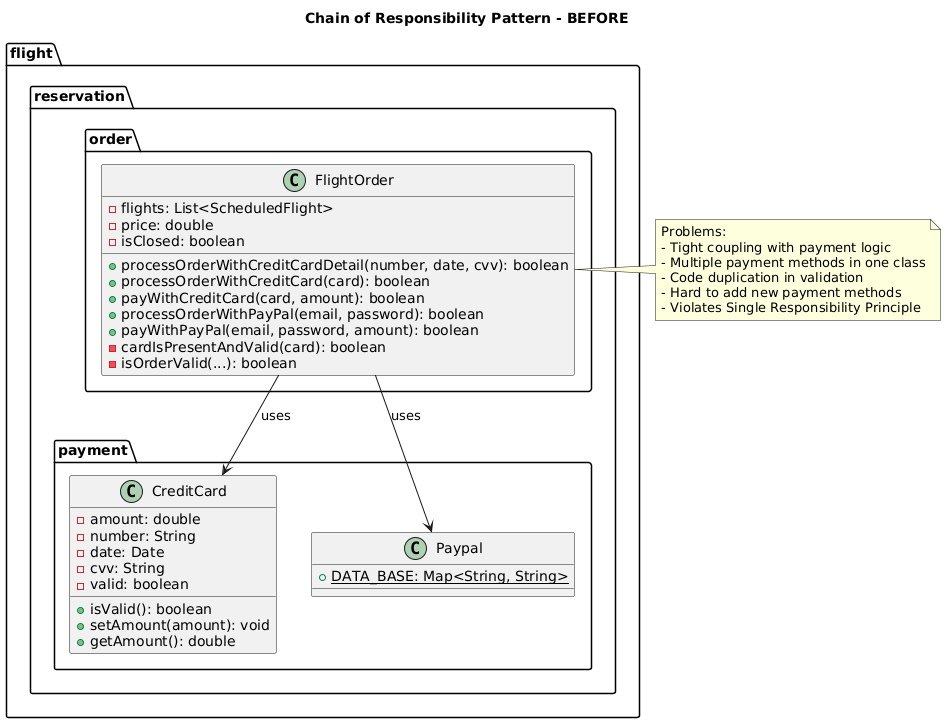
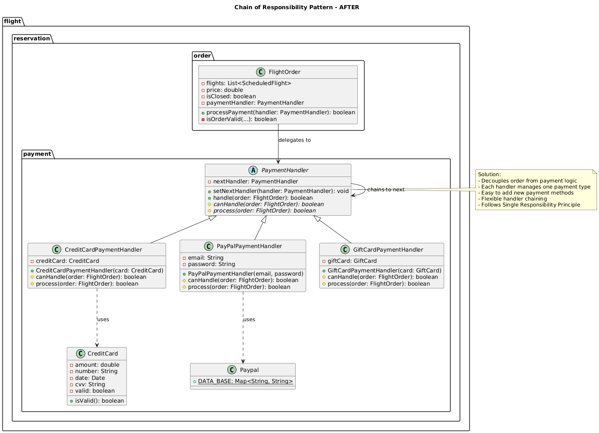

# Factory Pattern

## Problem Identified  

**Location:** `flight/plane/` directory and `ScheduledFlight.java`

### Issue Description

- Multiple aircraft types exist: `PassengerPlane`, `Helicopter`, `PassengerDrone`
- `Flight` class uses a generic **Object** type for the aircraft field instead of a proper hierarchy
- **Excessive use of `instanceof` checks** throughout the codebase
- Aircraft creation logic **duplicated** across many classes
- Direct instantiation creates **tight coupling** with client code
- Adding a new aircraft type forces changes in multiple classes → violates Open/Closed Principle

---

## Why Factory Pattern?

The **Factory Pattern** centralizes object creation and eliminates type-checking.  
It allows polymorphism by returning objects through a common interface.

---

## Specific Challenges & Requirements

### Challenges

1. **Type Uncertainty**: Aircraft stored as `Object` type → requires `instanceof` checks and casting
2. **Scattered Creation**: Aircraft instantiated in multiple places (Runner.java, Test files) → inconsistent initialization
3. **Incompatible Interfaces**: 
   - `PassengerPlane` uses public field: `passengerCapacity`
   - `Helicopter` uses getter: `getPassengerCapacity()`
   - `PassengerDrone` hardcodes capacity: `4`
4. **Open/Closed Violation**: Adding new aircraft type requires modifying `ScheduledFlight.getCapacity()` and multiple other classes
5. **Validation Issues**: No centralized validation → invalid aircraft objects can be created
6. **Testing Difficulty**: Hard to create mocks/test doubles without a common interface

### Requirements

- Support multiple aircraft types with different internal structures
- Enable easy addition of new aircraft types without code changes
- Provide consistent interface for all aircraft operations
- Centralize initialization and validation logic
- Maintain type safety at compile time
- Enable testability through dependency injection

### How Factory Pattern Addresses These

- Defines `Aircraft` interface → all types implement it
- Centralizes creation logic in `AircraftFactory`
- Eliminates `instanceof` checks → uses polymorphism
- Adding new aircraft only requires new class + factory method update
- Validation happens in one place during creation
- Enables mocking through common interface

---

## Benefits

- Removes scattered instantiation logic  
- Eliminates `instanceof` and type casting  
- Centralizes aircraft validation + initialization  
- New aircraft types can be added **without modifying existing code**  
- Reduces coupling between creation and usage  
- Follows **Single Responsibility Principle** — creation logic is isolated  

---

## Drawbacks

- Adds an extra abstraction layer  
- Requires a common `Aircraft` interface  
- Slightly more complex initial setup  
- Might be overkill for very small systems  

---

## Class Diagrams

### **Before Factory Pattern**



### **After Factory Pattern**



---

## Code Changes

### 1. Created `Aircraft` Interface

**New File:** `flight/reservation/plane/Aircraft.java`

```java
package flight.reservation.plane;

public interface Aircraft {
    int getPassengerCapacity();
    int getCrewCapacity();
    String getModel();
}
```

### 2. Updated `PassengerPlane` to Implement `Aircraft`

**File:** `flight/reservation/plane/PassengerPlane.java`

**Before:**
```java
public class PassengerPlane {
    public String model;
    public int passengerCapacity;
    public int crewCapacity;
    // ... no getters, public fields
}
```

**After:**
```java
public class PassengerPlane implements Aircraft {
    private String model;
    private int passengerCapacity;
    private int crewCapacity;

    @Override
    public int getPassengerCapacity() { return passengerCapacity; }
    
    @Override
    public int getCrewCapacity() { return crewCapacity; }
    
    @Override
    public String getModel() { return model; }
}
```

### 3. Updated `Helicopter` to Implement `Aircraft`

**File:** `flight/reservation/plane/Helicopter.java`

**Before:**
```java
public class Helicopter {
    // ... only had getModel() and getPassengerCapacity()
}
```

**After:**
```java
public class Helicopter implements Aircraft {
    @Override
    public int getPassengerCapacity() { return passengerCapacity; }
    
    @Override
    public int getCrewCapacity() { return 2; }
    
    @Override
    public String getModel() { return model; }
}
```

### 4. Updated `PassengerDrone` to Implement `Aircraft`

**File:** `flight/reservation/plane/PassengerDrone.java`

**Before:**
```java
public class PassengerDrone {
    private final String model;
    // No methods to get capacity
}
```

**After:**
```java
public class PassengerDrone implements Aircraft {
    private static final int PASSENGER_CAPACITY = 4;
    private static final int CREW_CAPACITY = 0;

    @Override
    public int getPassengerCapacity() { return PASSENGER_CAPACITY; }
    
    @Override
    public int getCrewCapacity() { return CREW_CAPACITY; }
    
    @Override
    public String getModel() { return model; }
}
```

### 5. Created `AircraftFactory`

**New File:** `flight/reservation/plane/AircraftFactory.java`

```java
package flight.reservation.plane;

public class AircraftFactory {
    public static Aircraft createPassengerPlane(String model) {
        return new PassengerPlane(model);
    }

    public static Aircraft createHelicopter(String model) {
        return new Helicopter(model);
    }

    public static Aircraft createPassengerDrone(String model) {
        return new PassengerDrone(model);
    }

    public static Aircraft createAircraft(String type, String model) {
        switch (type.toUpperCase()) {
            case "PLANE": return createPassengerPlane(model);
            case "HELICOPTER": return createHelicopter(model);
            case "DRONE": return createPassengerDrone(model);
            default: throw new IllegalArgumentException("Unknown aircraft type: " + type);
        }
    }
}
```

### 6. Refactored `Flight.java` — Eliminated `instanceof` Checks

**File:** `flight/reservation/flight/Flight.java`

**Before:**
```java
protected Object aircraft;

private boolean isAircraftValid(Airport airport) {
    return Arrays.stream(airport.getAllowedAircrafts()).anyMatch(x -> {
        String model;
        if (this.aircraft instanceof PassengerPlane) {
            model = ((PassengerPlane) this.aircraft).model;
        } else if (this.aircraft instanceof Helicopter) {
            model = ((Helicopter) this.aircraft).getModel();
        } else if (this.aircraft instanceof PassengerDrone) {
            model = "HypaHype";
        } else {
            throw new IllegalArgumentException("Aircraft is not recognized");
        }
        return x.equals(model);
    });
}
```

**After:**
```java
protected Aircraft aircraft;

private boolean isAircraftValid(Airport airport) {
    return Arrays.stream(airport.getAllowedAircrafts())
        .anyMatch(x -> x.equals(aircraft.getModel()));
}
```

### 7. Refactored `ScheduledFlight.java` — Eliminated `instanceof` Checks

**File:** `flight/reservation/flight/ScheduledFlight.java`

**Before:**
```java
public int getCrewMemberCapacity() throws NoSuchFieldException {
    if (this.aircraft instanceof PassengerPlane) {
        return ((PassengerPlane) this.aircraft).crewCapacity;
    }
    if (this.aircraft instanceof Helicopter) {
        return 2;
    }
    if (this.aircraft instanceof PassengerDrone) {
        return 0;
    }
    throw new NoSuchFieldException("no crew capacity info");
}

public int getCapacity() throws NoSuchFieldException {
    if (this.aircraft instanceof PassengerPlane) {
        return ((PassengerPlane) this.aircraft).passengerCapacity;
    }
    if (this.aircraft instanceof Helicopter) {
        return ((Helicopter) this.aircraft).getPassengerCapacity();
    }
    if (this.aircraft instanceof PassengerDrone) {
        return 4;
    }
    throw new NoSuchFieldException("no capacity info");
}
```

**After:**
```java
public int getCrewMemberCapacity() throws NoSuchFieldException {
    return this.aircraft.getCrewCapacity();
}

public int getCapacity() throws NoSuchFieldException {
    return this.aircraft.getPassengerCapacity();
}
```

### 8. Updated `Runner.java` — Use Factory

**File:** `Runner.java`

**Before:**
```java
static List<Object> aircrafts = Arrays.asList(
    new PassengerPlane("A380"),
    new Helicopter("H1"),
    new PassengerDrone("HypaHype")
);
```

**After:**
```java
static List<Aircraft> aircrafts = Arrays.asList(
    AircraftFactory.createPassengerPlane("A380"),
    AircraftFactory.createHelicopter("H1"),
    AircraftFactory.createPassengerDrone("HypaHype")
);
```

### 9. Updated Test Files

**Files:** `ScenarioTest.java`, `ScheduleTest.java`

All direct instantiations like `new Helicopter("H1")` replaced with:
```java
AircraftFactory.createHelicopter("H1")
```

---

## Summary of Changes

| File | Change Type | Description |
|------|-------------|-------------|
| `Aircraft.java` | **New** | Common interface for all aircraft types |
| `AircraftFactory.java` | **New** | Factory for creating aircraft instances |
| `PassengerPlane.java` | **Modified** | Implements `Aircraft`, added getters |
| `Helicopter.java` | **Modified** | Implements `Aircraft`, added `getCrewCapacity()` |
| `PassengerDrone.java` | **Modified** | Implements `Aircraft`, added all required methods |
| `Flight.java` | **Modified** | Uses `Aircraft` type, removed `instanceof` checks |
| `ScheduledFlight.java` | **Modified** | Simplified to use polymorphic calls |
| `Runner.java` | **Modified** | Uses `AircraftFactory` for creation |
| `ScenarioTest.java` | **Modified** | Uses `AircraftFactory` for test setup |
| `ScheduleTest.java` | **Modified** | Uses `AircraftFactory` for test setup |

---

# Chain of Responsibility Pattern

## Problem Identified  

**Location:** `flight/reservation/order/FlightOrder.java` and `flight/reservation/payment/` directory

### Issue Description

- Multiple payment methods hardcoded in `FlightOrder` class: `processOrderWithCreditCard()` and `processOrderWithPayPal()`
- **Tight coupling** between order processing and payment handling logic
- Payment validation logic **duplicated** across different payment methods
- Each payment method has similar structure: validate → process → mark as closed
- Adding new payment methods requires **modifying the FlightOrder class** → violates Open/Closed Principle
- No clear separation between payment method validation and actual payment processing
- **Conditional logic** required to choose payment method at runtime

---

## Why Chain of Responsibility Pattern?

The **Chain of Responsibility Pattern** decouples senders and receivers by allowing multiple handlers to process a request.  
Each handler decides whether to process the request or pass it to the next handler in the chain.

---

## Specific Challenges & Requirements

### Challenges

1. **Tight Coupling**: Payment logic directly embedded in `FlightOrder` class → hard to maintain and extend
2. **Code Duplication**: Each payment method repeats validation and order closure logic
3. **Mixed Responsibilities**: `FlightOrder` handles both order management AND payment processing
4. **Extensibility Issues**: Adding new payment methods (e.g., Bank Transfer, Crypto, Gift Cards) requires modifying `FlightOrder`
5. **Testing Difficulty**: Cannot test payment handlers independently from order logic
6. **Inflexible Payment Flow**: Cannot dynamically configure which payment methods are available or change priority

### Requirements

- Support multiple payment methods with different validation rules
- Enable easy addition of new payment methods without modifying existing code
- Separate payment processing logic from order management
- Allow flexible payment handler chaining and prioritization
- Maintain consistent payment processing flow
- Enable independent testing of each payment handler

### How Chain of Responsibility Addresses These

- Defines `PaymentHandler` interface/abstract class → all handlers implement it
- Each handler decides if it can process the payment or passes to next handler
- `FlightOrder` delegates to payment chain instead of handling payments directly
- Adding new payment method only requires creating new handler and adding to chain
- Handlers can be reordered or removed without affecting other handlers
- Each handler can be tested independently

---

## Benefits

- Removes payment logic from `FlightOrder` → follows **Single Responsibility Principle**
- Eliminates code duplication across payment methods
- New payment handlers can be added **without modifying existing code** → Open/Closed Principle
- Flexible handler configuration and chaining
- Improved testability through handler isolation
- Decouples request sender (FlightOrder) from receivers (payment handlers)
- Allows dynamic runtime handler chain configuration

---

## Drawbacks

- Request might not be handled if no handler can process it
- Debugging can be harder as execution path goes through chain
- Slightly more complex initial setup
- Need to ensure chain is properly configured
- May have performance overhead if chain is long

---

## Class Diagrams

### **Before Chain of Responsibility Pattern**



### **After Chain of Responsibility Pattern**



---

## Code Changes

### 1. Created `PaymentHandler` Abstract Class

**New File:** `flight/reservation/payment/PaymentHandler.java`

```java
package flight.reservation.payment;

import flight.reservation.order.FlightOrder;

public abstract class PaymentHandler {
    
    protected PaymentHandler nextHandler;
    
    public PaymentHandler setNext(PaymentHandler nextHandler) {
        this.nextHandler = nextHandler;
        return nextHandler;
    }
    
    public boolean handle(FlightOrder order) throws IllegalStateException {
        if (canHandle()) {
            return process(order);
        } else if (nextHandler != null) {
            return nextHandler.handle(order);
        }
        throw new IllegalStateException("No payment handler could process this request.");
    }
    
    protected abstract boolean canHandle();
    
    protected abstract boolean process(FlightOrder order) throws IllegalStateException;
}
```

### 2. Created `CreditCardPaymentHandler`

**New File:** `flight/reservation/payment/CreditCardPaymentHandler.java`

```java
package flight.reservation.payment;

import flight.reservation.order.FlightOrder;

public class CreditCardPaymentHandler extends PaymentHandler {
    
    private final CreditCard creditCard;
    
    public CreditCardPaymentHandler(CreditCard creditCard) {
        this.creditCard = creditCard;
    }
    
    @Override
    protected boolean canHandle() {
        return creditCard != null && creditCard.isValid();
    }
    
    @Override
    protected boolean process(FlightOrder order) throws IllegalStateException {
        if (order.isClosed()) {
            return true;
        }
        
        if (!canHandle()) {
            throw new IllegalStateException("Payment information is not set or not valid.");
        }
        
        System.out.println("Paying " + order.getPrice() + " using Credit Card.");
        double remainingAmount = creditCard.getAmount() - order.getPrice();
        
        if (remainingAmount < 0) {
            throw new IllegalStateException("Card limit reached");
        }
        
        creditCard.setAmount(remainingAmount);
        order.setClosed();
        return true;
    }
}
```

### 3. Created `PayPalPaymentHandler`

**New File:** `flight/reservation/payment/PayPalPaymentHandler.java`

```java
package flight.reservation.payment;

import flight.reservation.order.FlightOrder;

public class PayPalPaymentHandler extends PaymentHandler {
    
    private final String email;
    private final String password;
    
    public PayPalPaymentHandler(String email, String password) {
        this.email = email;
        this.password = password;
    }
    
    @Override
    protected boolean canHandle() {
        return email != null && password != null && 
               email.equals(Paypal.DATA_BASE.get(password));
    }
    
    @Override
    protected boolean process(FlightOrder order) throws IllegalStateException {
        if (order.isClosed()) {
            return true;
        }
        
        if (!canHandle()) {
            throw new IllegalStateException("Payment information is not set or not valid.");
        }
        
        System.out.println("Paying " + order.getPrice() + " using PayPal.");
        order.setClosed();
        return true;
    }
}
```

### 4. Refactored `FlightOrder.java` — Delegates to Payment Handlers

**File:** `flight/reservation/order/FlightOrder.java`

**Before:**
```java
public boolean processOrderWithCreditCard(CreditCard creditCard) throws IllegalStateException {
    if (isClosed()) {
        return true;
    }
    if (!cardIsPresentAndValid(creditCard)) {
        throw new IllegalStateException("Payment information is not set or not valid.");
    }
    boolean isPaid = payWithCreditCard(creditCard, this.getPrice());
    if (isPaid) {
        this.setClosed();
    }
    return isPaid;
}

public boolean processOrderWithPayPal(String email, String password) throws IllegalStateException {
    if (isClosed()) {
        return true;
    }
    if (email == null || password == null || !email.equals(Paypal.DATA_BASE.get(password))) {
        throw new IllegalStateException("Payment information is not set or not valid.");
    }
    boolean isPaid = payWithPayPal(email, password, this.getPrice());
    if (isPaid) {
        this.setClosed();
    }
    return isPaid;
}

public boolean payWithCreditCard(CreditCard card, double amount) throws IllegalStateException {
    // ... 15+ lines of payment logic
}

public boolean payWithPayPal(String email, String password, double amount) throws IllegalStateException {
    // ... payment logic
}
```

**After:**
```java
/**
 * Process payment using Chain of Responsibility pattern.
 */
public boolean processPayment(PaymentHandler handler) throws IllegalStateException {
    return handler.handle(this);
}

public boolean processOrderWithCreditCard(CreditCard creditCard) throws IllegalStateException {
    PaymentHandler handler = new CreditCardPaymentHandler(creditCard);
    return processPayment(handler);
}

public boolean processOrderWithPayPal(String email, String password) throws IllegalStateException {
    PaymentHandler handler = new PayPalPaymentHandler(email, password);
    return processPayment(handler);
}
```

### 5. Example: Chaining Multiple Payment Handlers

With the new pattern, you can easily chain payment methods:

```java
// Try credit card first, then fall back to PayPal
PaymentHandler creditCardHandler = new CreditCardPaymentHandler(creditCard);
PaymentHandler paypalHandler = new PayPalPaymentHandler(email, password);

creditCardHandler.setNext(paypalHandler);

// This will try credit card first, if it fails, try PayPal
order.processPayment(creditCardHandler);
```

### 6. Adding New Payment Methods

To add a new payment method (e.g., Bank Transfer), simply create a new handler:

```java
public class BankTransferPaymentHandler extends PaymentHandler {
    private final String accountNumber;
    private final String routingNumber;
    
    public BankTransferPaymentHandler(String accountNumber, String routingNumber) {
        this.accountNumber = accountNumber;
        this.routingNumber = routingNumber;
    }
    
    @Override
    protected boolean canHandle() {
        return accountNumber != null && routingNumber != null;
    }
    
    @Override
    protected boolean process(FlightOrder order) throws IllegalStateException {
        // Bank transfer logic
        System.out.println("Paying " + order.getPrice() + " using Bank Transfer.");
        order.setClosed();
        return true;
    }
}
```

No changes to `FlightOrder` required!

---

## Summary of Changes

| File | Change Type | Description |
|------|-------------|-------------|
| `PaymentHandler.java` | **New** | Abstract handler base class with chain logic |
| `CreditCardPaymentHandler.java` | **New** | Concrete handler for credit card payments |
| `PayPalPaymentHandler.java` | **New** | Concrete handler for PayPal payments |
| `FlightOrder.java` | **Modified** | Delegates payment to handlers, removed duplicate logic |

---

## Lines of Code Comparison

| Metric | Before | After |
|--------|--------|-------|
| `FlightOrder.java` payment methods | ~50 lines | ~15 lines |
| Payment logic duplication | High | None |
| Adding new payment method | Modify `FlightOrder` | Create new handler class |
| Testability | Hard | Easy (test handlers independently) |
